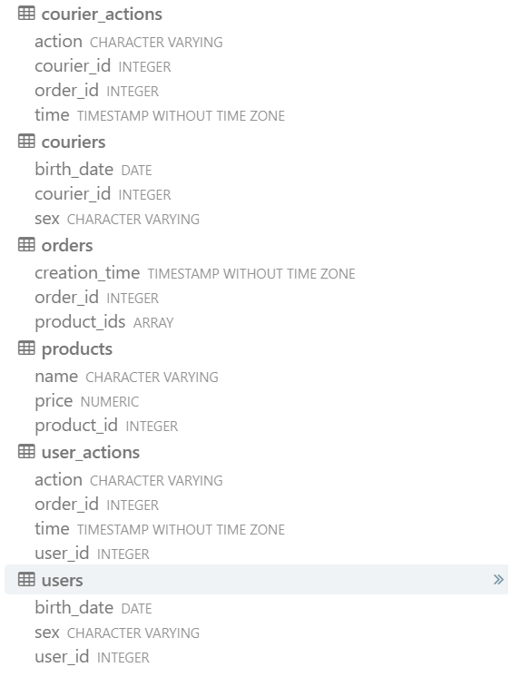

# Analysis_delivery_app_SQL
**Цель:** написание SQL-запросов для анализа динамики роста аудитории сервиса и ключевых продуктовых метрик. 
**Стэк:** SQL, PostgreSQL, Redash

В данном проекте реализованы сложные SQL-запросы к базе данных food delivery-сервиса с применением оконных функций, cte и подзапросов. Запросы написаны в интерфейсе платформы Redash, там же собирался финальный дашборд.
Таблицы, представленные в данных: `courier_actions` - действия курьеров, `user_actions` - действия пользователей, `users` - данные пользователей, `couriers` - данные курьеров, `products` - перечень сведений о товарах и их цене, `orders` - логи с заказами.
Схема представлена ниже:

С текстом запросов можно ознакомиться в соответствущих .sql файлах.

**Результаты:**  

1) Построены графики с динамикой ежедневного прироста пользователей и курьеров в абсолютных и относительных величинах

New users and couriers dynamic / change 

  

Total users and couriers dynamic / change 

 

2) Проанализирована динамика платящих юзеров и активных курьеров

Paying users and active couriers / share

 

3) Проанализирована динамика заказов

First orders dynamic / share 

 

Cancel rate per hour dynamic

4) Проанализирована динамика основных метрик: revenue, ARPU, ARPPU, AOV (текущие и накопленные)

Daily revenue

Main metrics / Running metrics

 

